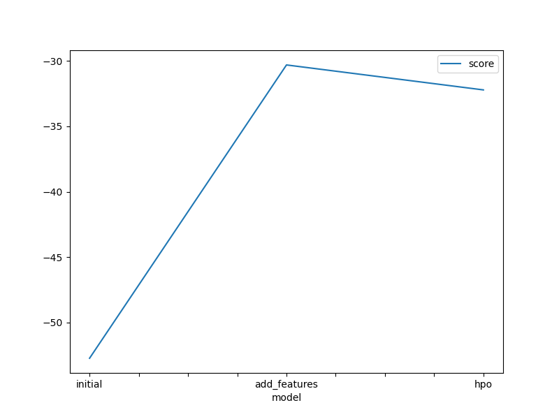
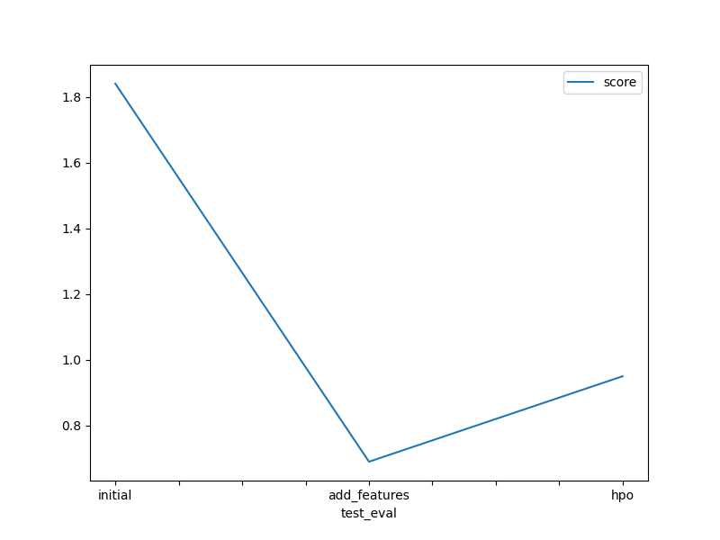

# Report: Predict Bike Sharing Demand with AutoGluon Solution
#### NAME HERE

## Initial Training
### What did you realize when you tried to submit your predictions? What changes were needed to the output of the predictor to submit your results?
All the predictions had to be non-negative.

### What was the top ranked model that performed?
A stack 3 weighted ensemble model.

## Exploratory data analysis and feature creation
### What did the exploratory analysis find and how did you add additional features?
Observations:
All the seasons occured equal number of times.
Holidays and working day are Yes/No variables with 1 = Yes and 0 = No.
temp and atemp follow a gaussian spread with peaks aound 20-25 C.
Humidity range: 0-100, Windspeed range: 0-45.
Count Range: 0-1000.
Additional features 'month' and 'hour' were added from extracting values from the 'datetime' column in the dataset-
### How much better did your model preform after adding additional features and why do you think that is?
The -(eval_score) for the best model went from -52 to -32. It is natural that the number of rentals should depend on what time of day. A lot of people have time during Christmas vacations (Dec-Jan). This information was provided to the model in the form of the new features. This made the model perform better.
## Hyper parameter tuning
### How much better did your model preform after trying different hyper parameters?
I used the str 'light' as the hyper-parameter. It limits the depth of the trees/ number of nodes in an NN. Surprisingly it did not change the eval_score much. However a different set of model were trained. Although the best performing model was a weighted ensemble model L3, the component models differ after tuning the hyperparameters.

### If you were given more time with this dataset, where do you think you would spend more time?
Training more complex DL or Tree-based models. 
### Create a table with the models you ran, the hyperparameters modified, and the kaggle score.
|model|hpo1|hpo2|hpo3|score|
|--|--|--|--|--|
|initial|?|?|?|?|
|add_features|?|?|?|?|
|hpo|?|?|?|?|

### Create a line plot showing the top model score for the three (or more) training runs during the project.

### Create a line plot showing the top kaggle score for the three (or more) prediction submissions during the project.

## Summary
TODO: Add your explanation
